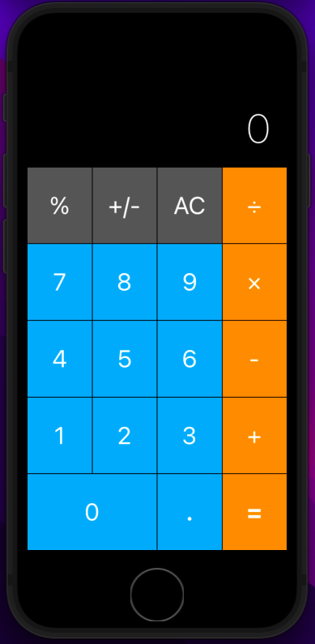
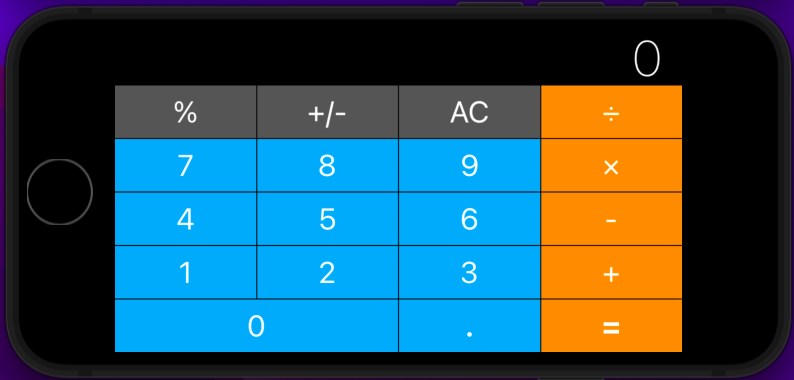

# Simple Calculator App 

Challenge from Udemy course https://www.udemy.com/course/ios-13-app-development-bootcamp/.

Challenge was to design the calculator such that it can be seen in portrait or landscape across differ iPhones and iPads. As an extra I made the app functional, rather then just having a GUI.

## Portrait

## Landscape

